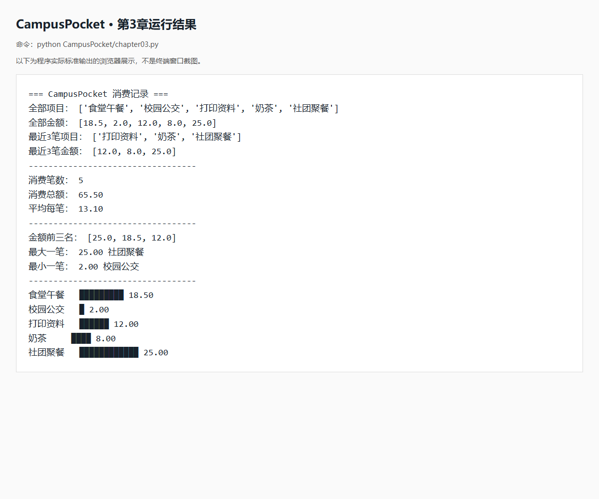

# 第3章实验报告：CampusPocket 校园账本

## 一、题目和目的

利用序列保存一组消费，显示全部记录与最近3笔，并计算总额、笔数、平均值。使用题目指定的5笔消费，不接收输入。选做金额排名、最大最小消费查询及每2元一个方块的条形图。

## 二、实现方法

items保存项目名，amounts保存对应金额；同一位置代表同一笔消费。用[-3:]获取最近3笔，用len、sum计算笔数和总额。sorted生成从大到小的新列表，不改变原始记账顺序；index查询最大和最小金额的位置。尚未学习循环，条形图用5行print分别输出。

## 三、代码

```python
# 第3章：用两个列表保存5笔消费
items = ["食堂午餐", "校园公交", "打印资料", "奶茶", "社团聚餐"]
amounts = [18.5, 2.0, 12.0, 8.0, 25.0]

print("=== CampusPocket 消费记录 ===")
print("全部项目：", items)
print("全部金额：", amounts)

# [-3:]表示取出最后3个元素，原来的顺序不变
print("最近3笔项目：", items[-3:])
print("最近3笔金额：", amounts[-3:])
print("----------------------------------")

# len求笔数，sum求总额
count = len(amounts)
total = sum(amounts)
average = total / count
print("消费笔数：", count)
print(f"消费总额： {total:.2f}")
print(f"平均每笔： {average:.2f}")
print("----------------------------------")

# reverse=True表示从大到小排序，[:3]取前三个
sorted_amounts = sorted(amounts, reverse=True)
print("金额前三名：", sorted_amounts[:3])

# index找到金额的位置，再到items中取对应的项目名
largest = max(amounts)
smallest = min(amounts)
print(f"最大一笔： {largest:.2f}", items[amounts.index(largest)])
print(f"最小一笔： {smallest:.2f}", items[amounts.index(smallest)])
print("----------------------------------")

# 每满2元画一个方块，ljust(6)在项目名右侧补空格
# 还没有学循环，所以先按顺序写5行
print(items[0].ljust(6), "█" * int(amounts[0] // 2), f"{amounts[0]:.2f}")
print(items[1].ljust(6), "█" * int(amounts[1] // 2), f"{amounts[1]:.2f}")
print(items[2].ljust(6), "█" * int(amounts[2] // 2), f"{amounts[2]:.2f}")
print(items[3].ljust(6), "█" * int(amounts[3] // 2), f"{amounts[3]:.2f}")
print(items[4].ljust(6), "█" * int(amounts[4] // 2), f"{amounts[4]:.2f}")

```

## 四、实际运行结果

在项目根目录运行 `python CampusPocket/chapter03.py`，无需输入。



图片为真实程序标准输出在浏览器中的展示截图，不是终端截图。如老师指定终端截图，请在VS Code终端运行同一命令后截图替换。

```text
=== CampusPocket 消费记录 ===
全部项目： ['食堂午餐', '校园公交', '打印资料', '奶茶', '社团聚餐']
全部金额： [18.5, 2.0, 12.0, 8.0, 25.0]
最近3笔项目： ['打印资料', '奶茶', '社团聚餐']
最近3笔金额： [12.0, 8.0, 25.0]
----------------------------------
消费笔数： 5
消费总额： 65.50
平均每笔： 13.10
----------------------------------
金额前三名： [25.0, 18.5, 12.0]
最大一笔： 25.00 社团聚餐
最小一笔： 2.00 校园公交
----------------------------------
食堂午餐   █████████ 18.50
校园公交   █ 2.00
打印资料   ██████ 12.00
奶茶     ████ 8.00
社团聚餐   ████████████ 25.00

```

## 五、验收

- 两个列表各5个元素，顺序与题目一致。
- 最近3笔为打印资料、奶茶、社团聚餐；对应12.0、8.0、25.0。
- 笔数5，总额65.50元，平均13.10元。
- 前三名金额25.0、18.5、12.0；最大为社团聚餐，最小为校园公交。
- 5行方块数依次为9、1、6、4、12，不满2元的部分不画。
- 前两版文件保留，第三版独立存放在CampusPocket/chapter03.py。

格式说明：题目正文要求金额保留两位小数，示例却显示一位。本版统计值和单笔金额采用两位小数；直接打印的列表使用Python默认数字格式。ljust(6)按字符数补空格，中文终端的显示宽度可能不同。

## 六、讨论与思考（参考，可按自己的理解修改）

1. 最容易出错的是两个列表的对应关系。例如只改变amounts的顺序，项目名就会与金额错配。所以排名用sorted得到新列表，保留原列表顺序。另一个容易出错的地方是切片：[-3:]表示最后3个，顺序不会反转。
2. 数据量变大后，逐行写print不便维护。学到循环后可以统一输出每一笔；学到其他数据结构后，可以把项目名、金额等信息放在同一条记录中，减少对应错误。
3. 本章的index只返回第一次出现的位置。若最大金额有多笔，这种写法只显示其中第一笔；本题数据没有这种情况。
